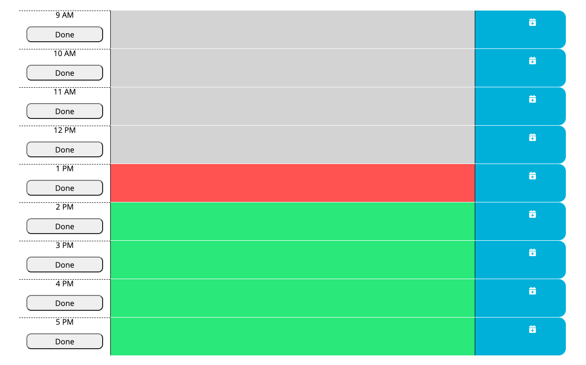
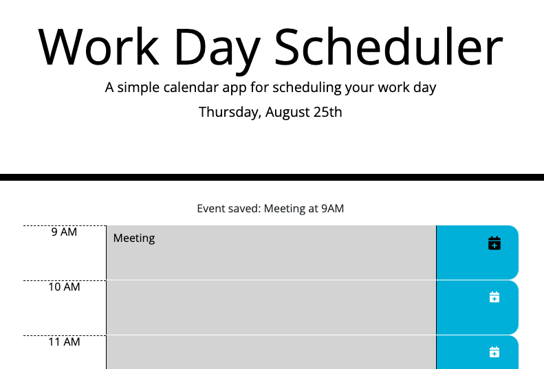
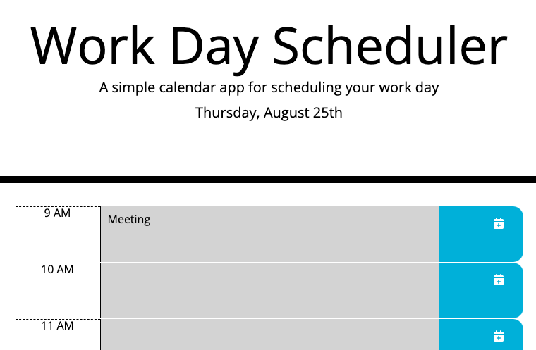
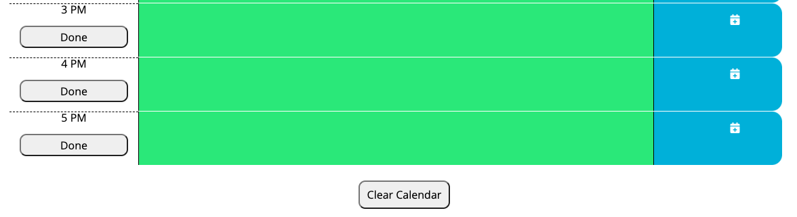

# Work Day Scheduler

## Description

The purpose of this application is to allow users to create and save events that will be occurring during the workday. This provides a visual representation of the day ahead and helps workers quickly find open time blocks for additional events. While building this application, I became comfortable with incorporating jQuery syntax, Bootstrap class naming conventions, and Moment.js methods into web applications.

## Table of Contents

  - [Installation](#installation)
  - [Usage](#usage)
  - [Credits](#credits)
  - [License](#license)
  - [Contributing](#contributing)
  - [Tests](#tests)
  - [Questions](#questions)

## Installation

N/A

## Usage

To access this application, visit the following URL: [https://rpecuch.github.io/work-day-scheduler/](https://rpecuch.github.io/work-day-scheduler/). The calendar blocks are color-coded based on the time of day: grey represents events that have already occurred, red represents events that are currently happening, and green represents events that are in the future.

To add an event, click on any colored block, type the name of the event, and click on the icon to add the event.

When the application is refreshed, all saved events will remain on the calendar. 

To clear all events from the calendar, click the button on the bottom of the page. To clear a single event, click on the button on the corresponding row.

## Credits

This project was based on the starter code from the super-disco repository belonging to the GitHub user @coding-boot-camp. The following third-party APIs were utilized: jQuery, Bootstrap, Moment.js, Google Fonts, and Font Awesome.

## License

Please refer to the license in the repo.

## Contributing

  Ways to contribute include suggesting bug fixes.
  
  ## Tests

  N/A

  ## Questions

  If you have any questions or would like to provide feedback, do not hesitate to view my GitHub profile at [https://github.com/rpecuch](https://github.com/rpecuch) or contact me at rpecuch@comcast.net.
